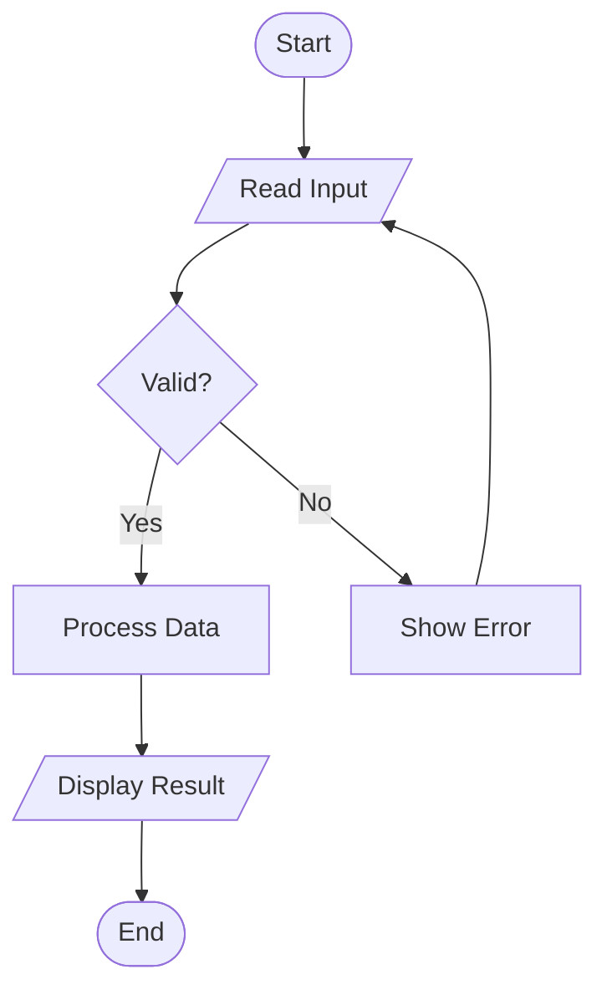
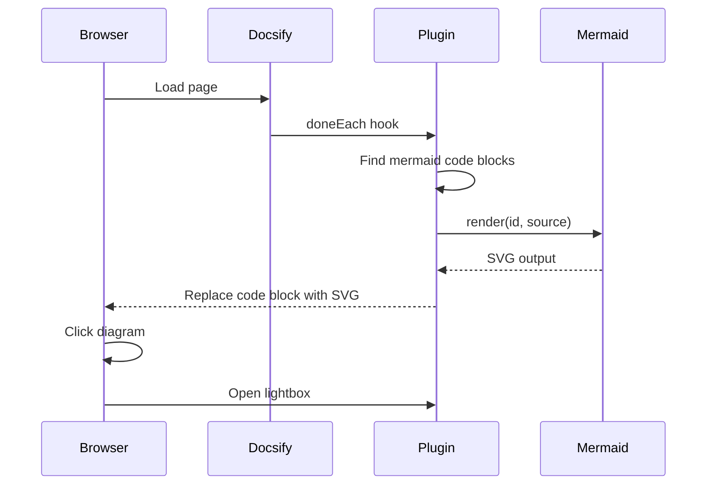
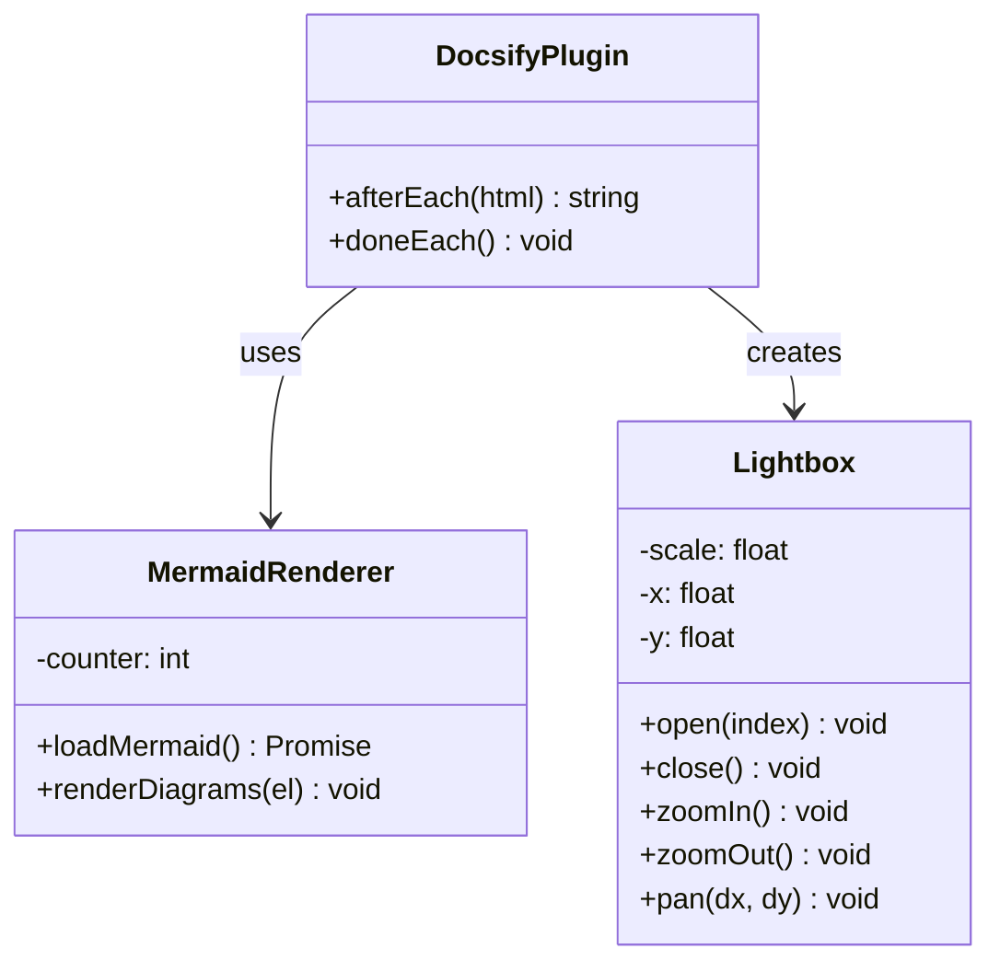
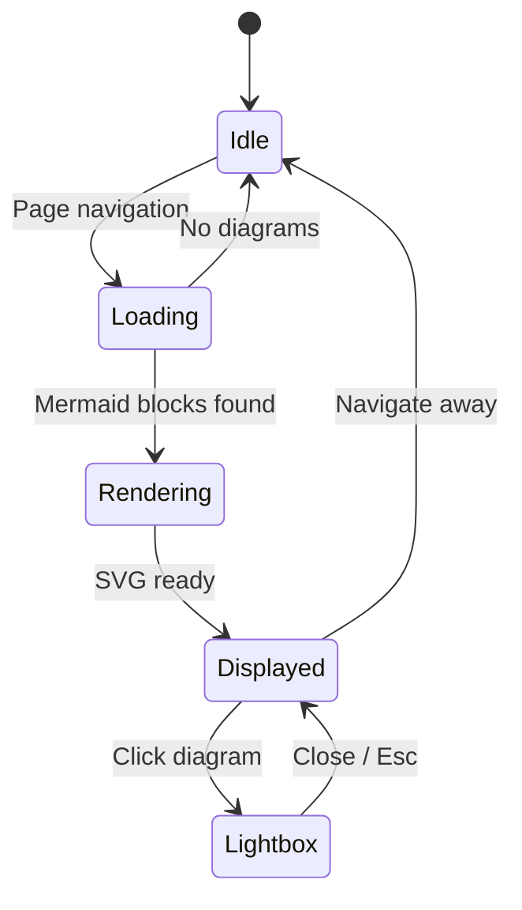
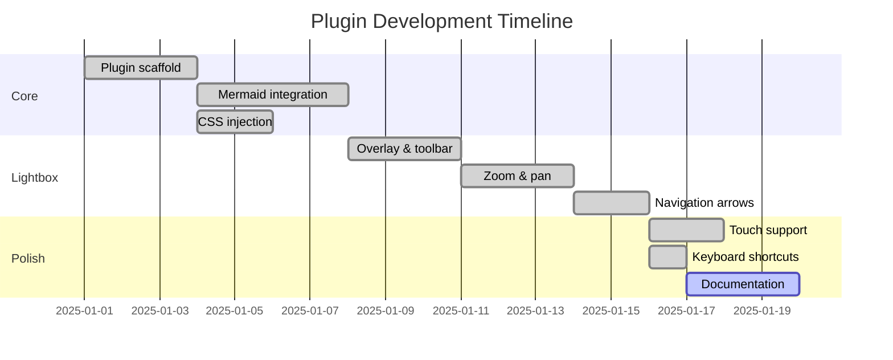
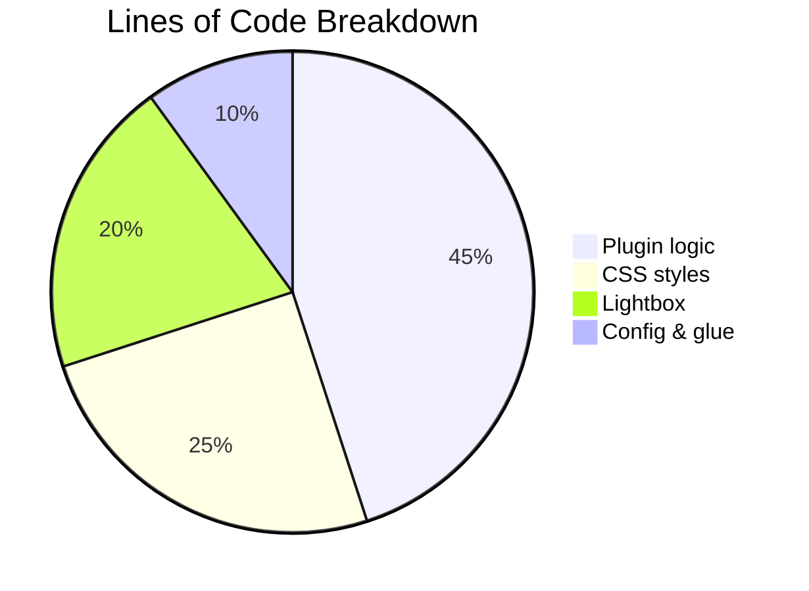
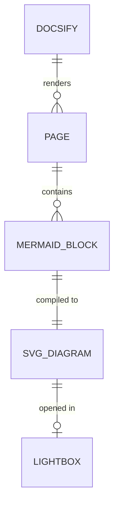
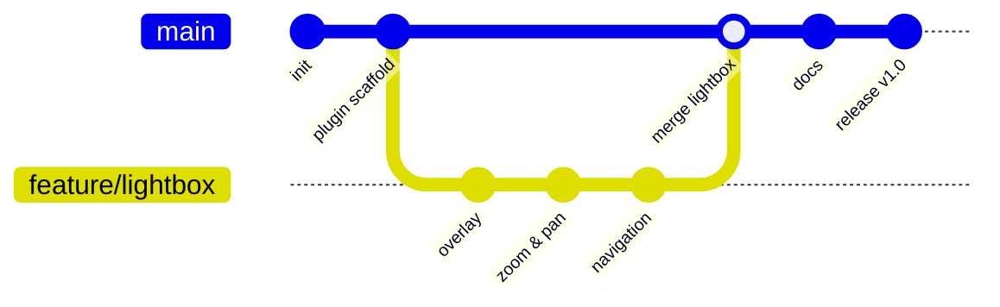

# Mermaid Examples

A collection of diagram types to test the plugin.

## Flowchart

## Sequence Diagram

## Class Diagram

## State Diagram

## Gantt Chart

## Pie Chart

## Entity Relationship

## Git Graph

