# Mermaid Complete Reference

> Comprehensive lexical dictionary, styling guide, naming conventions, and hidden features.  
> Based on [mermaid-js/mermaid](https://github.com/mermaid-js/mermaid) source.

---

## Table of Contents

- [1. Directives & Frontmatter](#_1-directives-amp-frontmatter)
- [2. Flowchart — Complete Node Shapes](#_2-flowchart--complete-node-shapes)
- [3. Flowchart — Link / Edge Styles](#_3-flowchart--link-edge-styles)
- [4. Flowchart — Subgraphs & Direction](#_4-flowchart--subgraphs-amp-direction)
- [5. Flowchart — Styling & Classes](#_5-flowchart--styling-amp-classes)
- [6. Flowchart — Interaction & Click](#_6-flowchart--interaction-amp-click)
- [7. Flowchart — FontAwesome & Unicode](#_7-flowchart--fontawesome-amp-unicode)
- [8. Sequence Diagram — Full Lexicon](#_8-sequence-diagram--full-lexicon)
- [9. Class Diagram](#_9-class-diagram)
- [10. State Diagram](#_10-state-diagram)
- [11. Entity Relationship Diagram](#_11-entity-relationship-diagram)
- [12. Gantt Chart — Advanced](#_12-gantt-chart--advanced)
- [13. Pie Chart](#_13-pie-chart)
- [14. Quadrant Chart](#_14-quadrant-chart)
- [15. Requirement Diagram](#_15-requirement-diagram)
- [16. Gitgraph](#_16-gitgraph)
- [17. C4 Diagram](#_17-c4-diagram)
- [18. Mindmap](#_18-mindmap)
- [19. Timeline](#_19-timeline)
- [20. Sankey Diagram](#_20-sankey-diagram)
- [21. XY Chart (Bar + Line)](#_21-xy-chart-bar-line)
- [22. Block Diagram](#_22-block-diagram)
- [23. Kanban Board](#_23-kanban-board)
- [24. Architecture Diagram](#_24-architecture-diagram)
- [25. Packet Diagram](#_25-packet-diagram)
- [26. Zenuml Sequence](#_26-zenuml-sequence)
- [27. Theming & %%init%%](#_27-theming-amp-init)
- [28. Naming Conventions & Best Practices](#_28-naming-conventions-amp-best-practices)
- [29. Hidden Features & Undocumented Tricks](#_29-hidden-features-amp-undocumented-tricks)

---

## 1. Directives & Frontmatter

Mermaid supports **directives** via `%%{init: {...}}%%` at the top of any diagram. This is the most powerful (and least documented) configuration surface.

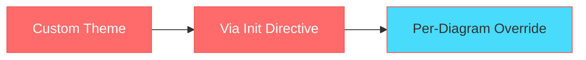
```mermaid
%%{init: {'theme': 'base', 'themeVariables': { 'primaryColor': '#ff6b6b', 'primaryTextColor': '#fff', 'primaryBorderColor': '#ee5a5a', 'lineColor': '#333', 'secondaryColor': '#feca57', 'tertiaryColor': '#48dbfb' }}}%%
graph LR
    A[Custom Theme] --> B[Via Init Directive]
    B --> C[Per-Diagram Override]
    style A fill:#ff6b6b,color:#fff
    style C fill:#48dbfb,color:#333
```

**Supported init keys:**
- `theme` — `'default'`, `'dark'`, `'forest'`, `'neutral'`, `'base'`
- `themeVariables` — override any CSS variable (see §27)
- `logLevel` — `'trace'`, `'debug'`, `'info'`, `'warn'`, `'error'`, `'fatal'`
- `securityLevel` — `'strict'`, `'loose'`, `'antiscript'`, `'sandbox'`
- `flowchart`, `sequence`, `gantt`, etc. — per-diagram config objects

---

## 2. Flowchart — Complete Node Shapes

Every node shape available in the flowchart/graph syntax:

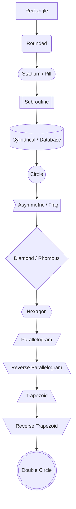
```mermaid
graph TD
    A[Rectangle] --> B(Rounded)
    B --> C([Stadium / Pill])
    C --> D[[Subroutine]]
    D --> E[(Cylindrical / Database)]
    E --> F((Circle))
    F --> G>Asymmetric / Flag]
    G --> H{Diamond / Rhombus}
    H --> I{{Hexagon}}
    I --> J[/Parallelogram/]
    J --> K[\Reverse Parallelogram\]
    K --> L[/Trapezoid\]
    L --> M[\Reverse Trapezoid/]
    M --> N(((Double Circle)))
```

### Node ID Naming Rules

- IDs can contain letters, digits, underscores, hyphens
- IDs are **case-sensitive**: `nodeA` ≠ `NodeA`
- Avoid starting with a digit (use `n1` not `1`)
- IDs with spaces require quotes: `A["my node"]`
- Reserved words to avoid as IDs: `end`, `graph`, `subgraph`, `style`, `classDef`, `click`

---

## 3. Flowchart — Link / Edge Styles

Every arrow and connection type:

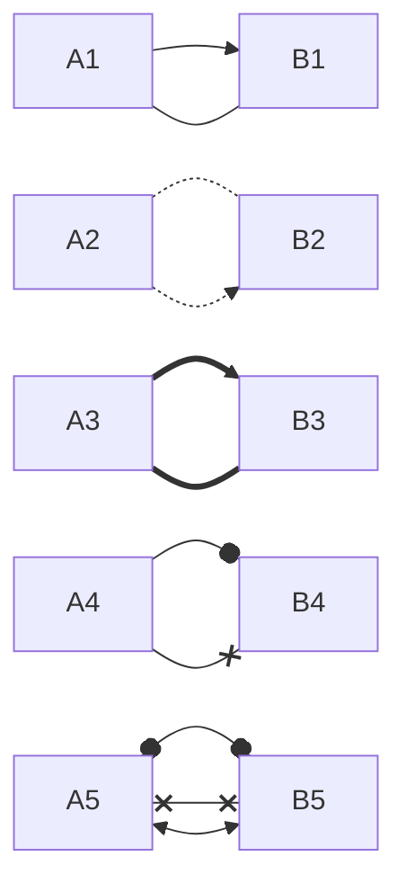
```mermaid
graph LR
    A1 --> B1
    A1 --- B1

    A2 -.- B2
    A2 -.-> B2

    A3 ==> B3
    A3 === B3

    A4 --o B4
    A4 --x B4

    A5 o--o B5
    A5 x--x B5
    A5 <--> B5
```

### Link types reference

| Syntax | Description |
|--------|-------------|
| `-->` | Arrow |
| `---` | Open link (no arrow) |
| `-.->` | Dotted arrow |
| `-.-` | Dotted open |
| `==>` | Thick arrow |
| `===` | Thick open |
| `--o` | Circle end |
| `--x` | Cross end |
| `o--o` | Circle both ends |
| `x--x` | Cross both ends |
| `<-->` | Arrow both ends |
| `-- text -->` | Arrow with label |
| `--> \|text\|` | Arrow with label (alt) |

### Extended link lengths

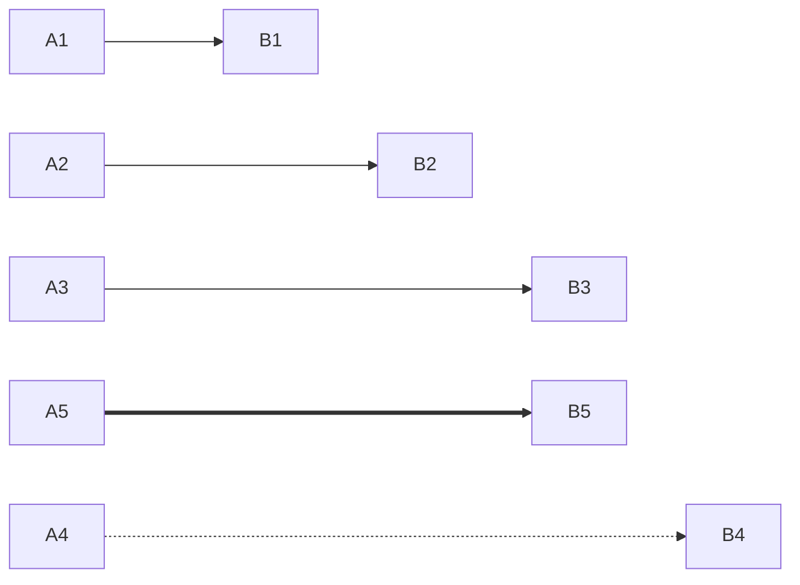
```mermaid
graph LR
    A1 ---> B1
    A2 ----> B2
    A3 -----> B3
    A4 -.....-> B4
    A5 =====> B5
```

| Normal | Extended | Extra long |
|--------|----------|------------|
| `-->` | `--->` | `---->` |
| `-.->` | `-..->` | `-...->` |
| `==>` | `===>` | `====>` |

---

## 4. Flowchart — Subgraphs & Direction

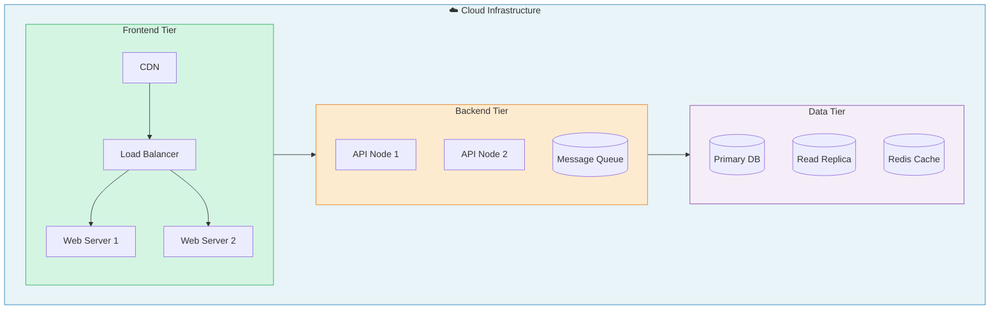
```mermaid
graph TB
    subgraph Cloud ["☁️ Cloud Infrastructure"]
        direction LR
        subgraph Frontend ["Frontend Tier"]
            direction TB
            CDN[CDN] --> LB[Load Balancer]
            LB --> W1[Web Server 1]
            LB --> W2[Web Server 2]
        end
        subgraph Backend ["Backend Tier"]
            direction TB
            API1[API Node 1]
            API2[API Node 2]
            Q[(Message Queue)]
        end
        subgraph Data ["Data Tier"]
            direction TB
            DB[(Primary DB)]
            R[(Read Replica)]
            CACHE[(Redis Cache)]
        end
    end
    Frontend --> Backend
    Backend --> Data

    style Cloud fill:#e8f4f8,stroke:#2980b9
    style Frontend fill:#d5f5e3,stroke:#27ae60
    style Backend fill:#fdebd0,stroke:#e67e22
    style Data fill:#f5eef8,stroke:#8e44ad
```

**Subgraph keywords:**
- `subgraph id ["Title"]` — named subgraph with display title
- `direction TB|BT|LR|RL` — override direction per subgraph
- `end` — closes subgraph

---

## 5. Flowchart — Styling & Classes

### Inline `style` keyword

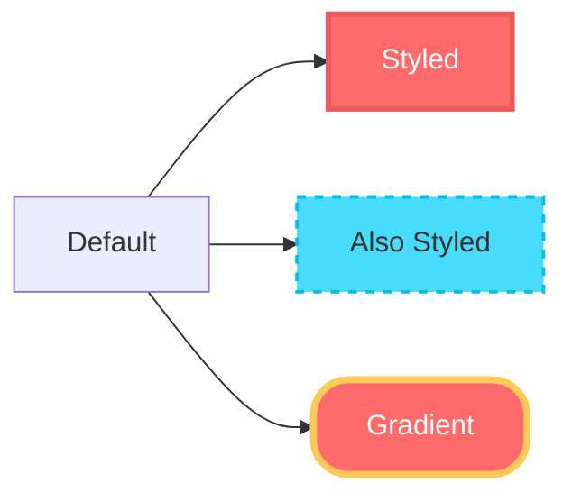
```mermaid
graph LR
    A[Default] --> B[Styled]
    A --> C[Also Styled]
    A --> D[Gradient]

    style B fill:#ff6b6b,stroke:#ee5a5a,stroke-width:3px,color:#fff
    style C fill:#48dbfb,stroke:#0abde3,stroke-width:2px,color:#333,stroke-dasharray: 5 5
    style D fill:#ff6b6b,stroke:#feca57,stroke-width:4px,color:#fff,rx:20,ry:20
```

### `classDef` + `class` — reusable styles

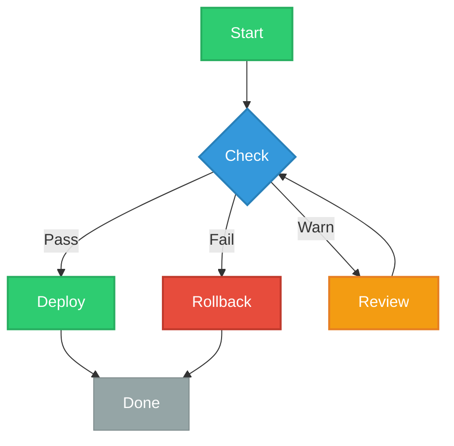
```mermaid
graph TD
    classDef success fill:#2ecc71,stroke:#27ae60,color:#fff,stroke-width:2px
    classDef danger fill:#e74c3c,stroke:#c0392b,color:#fff,stroke-width:2px
    classDef info fill:#3498db,stroke:#2980b9,color:#fff,stroke-width:2px
    classDef warning fill:#f39c12,stroke:#e67e22,color:#fff,stroke-width:2px
    classDef neutral fill:#95a5a6,stroke:#7f8c8d,color:#fff

    A[Start]:::success --> B{Check}:::info
    B -->|Pass| C[Deploy]:::success
    B -->|Fail| D[Rollback]:::danger
    B -->|Warn| E[Review]:::warning
    C --> F[Done]:::neutral
    D --> F
    E --> B
```

### Supported style properties

| Property | Example | Notes |
|----------|---------|-------|
| `fill` | `#ff0000`, `rgb(255,0,0)` | Background color |
| `stroke` | `#333` | Border color |
| `stroke-width` | `3px` | Border thickness |
| `stroke-dasharray` | `5 5`, `10 5 5 5` | Dashed border pattern |
| `color` | `#fff` | Text color |
| `rx`, `ry` | `20` | Corner radius (px) |
| `font-size` | `16px` | Text size |
| `font-weight` | `bold` | Text weight |
| `opacity` | `0.5` | Transparency |

### Link / edge styling

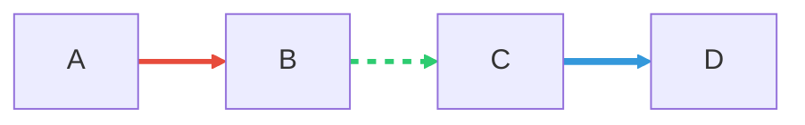
```mermaid
graph LR
    A --> B --> C --> D

    linkStyle 0 stroke:#e74c3c,stroke-width:3px
    linkStyle 1 stroke:#2ecc71,stroke-width:3px,stroke-dasharray: 5 5
    linkStyle 2 stroke:#3498db,stroke-width:4px
```

- `linkStyle N ...` — style the Nth link (0-indexed, in order of appearance)
- `linkStyle default ...` — style ALL links

---

## 6. Flowchart — Interaction & Click

> Requires `securityLevel: 'loose'` (our plugin sets this by default).

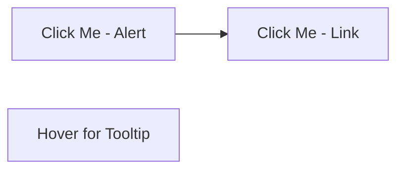
```mermaid
graph LR
    A[Click Me - Alert] --> B[Click Me - Link]
    C[Hover for Tooltip]

    click A callback "Alert triggered!"
    click B href "https://github.com/mermaid-js/mermaid" "Go to Mermaid repo" _blank
    click C href "#" "I am a tooltip"
```

**Syntax:**
- `click nodeId callback "tooltip"` — JS callback
- `click nodeId href "url" "tooltip" _blank` — hyperlink
- `click nodeId call functionName()` — call a JS function

---

## 7. Flowchart — FontAwesome & Unicode

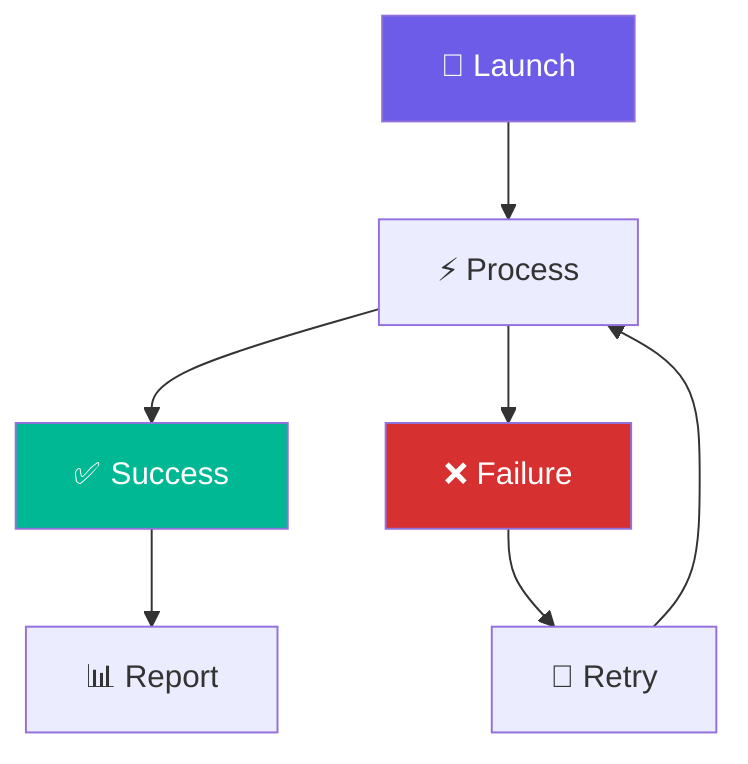
```mermaid
graph TD
    A["🚀 Launch"] --> B["⚡ Process"]
    B --> C["✅ Success"]
    B --> D["❌ Failure"]
    C --> E["📊 Report"]
    D --> F["🔄 Retry"]
    F --> B

    style A fill:#6c5ce7,color:#fff
    style C fill:#00b894,color:#fff
    style D fill:#d63031,color:#fff
```

> **Note:** FontAwesome icons (`fa:fa-icon`) work when FA is loaded. Unicode emoji work everywhere.

---

## 8. Sequence Diagram — Full Lexicon

### All arrow types

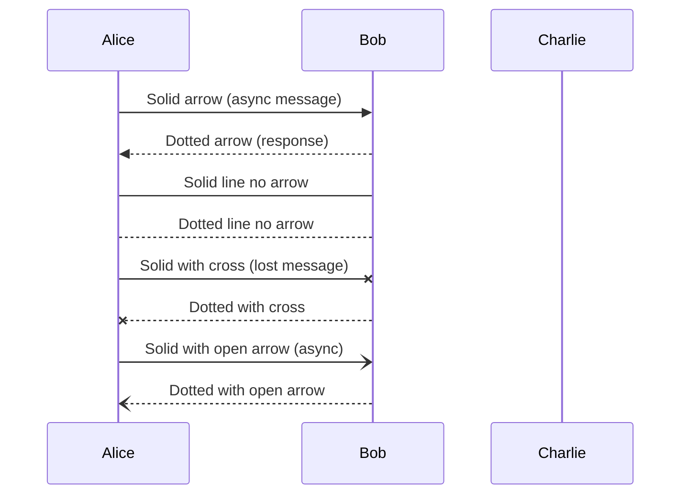
```mermaid
sequenceDiagram
    participant A as Alice
    participant B as Bob
    participant C as Charlie

    A->>B: Solid arrow (async message)
    B-->>A: Dotted arrow (response)
    A->B: Solid line no arrow
    B-->A: Dotted line no arrow
    A-xB: Solid with cross (lost message)
    B--xA: Dotted with cross
    A-)B: Solid with open arrow (async)
    B--)A: Dotted with open arrow
```

### Activation, notes, and boxes

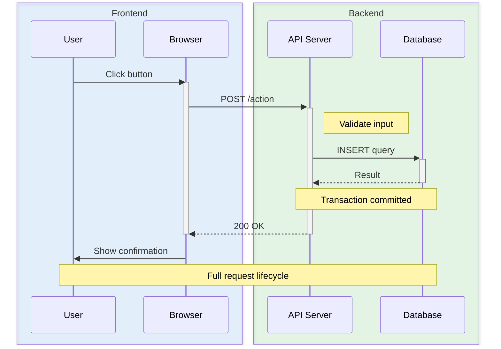
```mermaid
sequenceDiagram
    box rgba(30,144,255,0.1) Frontend
        participant U as User
        participant UI as Browser
    end
    box rgba(50,205,50,0.1) Backend
        participant API as API Server
        participant DB as Database
    end

    U->>UI: Click button
    activate UI
    UI->>+API: POST /action
    Note right of API: Validate input
    API->>+DB: INSERT query
    DB-->>-API: Result
    Note over API,DB: Transaction committed
    API-->>-UI: 200 OK
    deactivate UI
    UI->>U: Show confirmation

    Note over U,DB: Full request lifecycle
```

### Loops, alternatives, optionals, parallels, critical

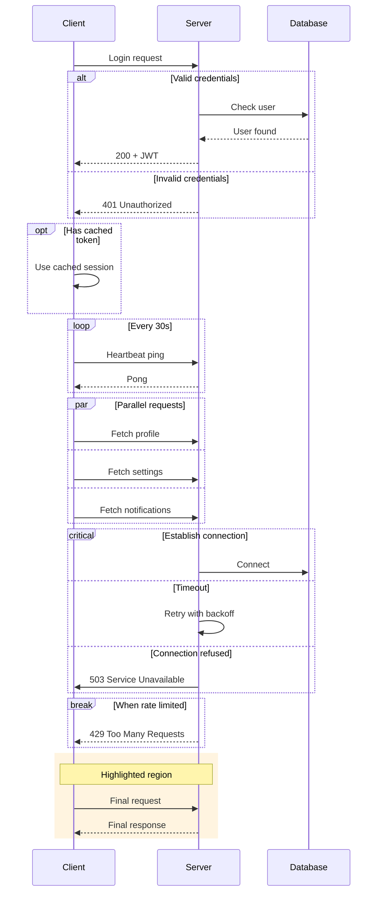
```mermaid
sequenceDiagram
    participant C as Client
    participant S as Server
    participant D as Database

    C->>S: Login request
    
    alt Valid credentials
        S->>D: Check user
        D-->>S: User found
        S-->>C: 200 + JWT
    else Invalid credentials
        S-->>C: 401 Unauthorized
    end

    opt Has cached token
        C->>C: Use cached session
    end

    loop Every 30s
        C->>S: Heartbeat ping
        S-->>C: Pong
    end

    par Parallel requests
        C->>S: Fetch profile
    and
        C->>S: Fetch settings
    and
        C->>S: Fetch notifications
    end

    critical Establish connection
        S->>D: Connect
    option Timeout
        S->>S: Retry with backoff
    option Connection refused
        S->>C: 503 Service Unavailable
    end

    break When rate limited
        S-->>C: 429 Too Many Requests
    end

    rect rgba(255,200,100,0.2)
        Note over C,S: Highlighted region
        C->>S: Final request
        S-->>C: Final response
    end
```

### Sequence numbers & autonumber

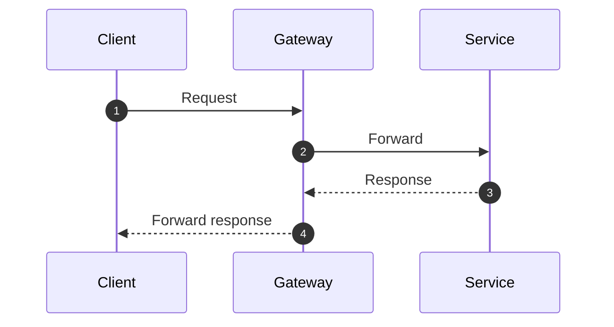
```mermaid
sequenceDiagram
    autonumber
    participant A as Client
    participant B as Gateway
    participant C as Service

    A->>B: Request
    B->>C: Forward
    C-->>B: Response
    B-->>A: Forward response
```

**Complete keyword reference:**

| Keyword | Usage |
|---------|-------|
| `participant` | Declare actor (box) |
| `actor` | Declare actor (stick figure) |
| `box` ... `end` | Group participants |
| `activate` / `deactivate` | Activation bars |
| `+` / `-` | Shorthand activate/deactivate |
| `Note left/right/over` | Annotations |
| `loop` ... `end` | Loop block |
| `alt` / `else` ... `end` | Conditional |
| `opt` ... `end` | Optional |
| `par` / `and` ... `end` | Parallel |
| `critical` / `option` ... `end` | Critical region |
| `break` ... `end` | Break out |
| `rect` ... `end` | Highlighted region |
| `autonumber` | Auto-number messages |
| `links` | Add external links to participant |

---

## 9. Class Diagram

### Full relationship types & visibility

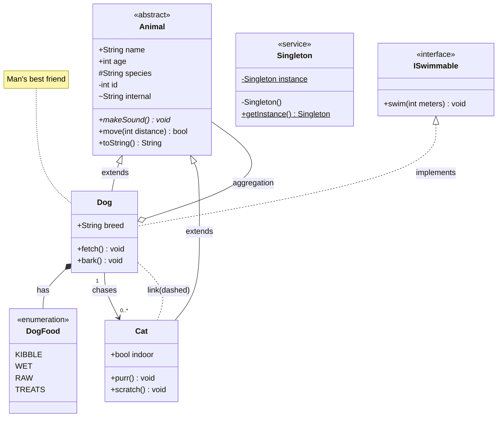
```mermaid
classDiagram
    class Animal {
        <<abstract>>
        +String name
        +int age
        #String species
        -int id
        ~String internal
        +makeSound()* void
        +move(int distance) bool
        +toString() String
    }

    class Dog {
        +String breed
        +fetch() void
        +bark() void
    }

    class Cat {
        +bool indoor
        +purr() void
        +scratch() void
    }

    class ISwimmable {
        <<interface>>
        +swim(int meters) void
    }

    class DogFood {
        <<enumeration>>
        KIBBLE
        WET
        RAW
        TREATS
    }

    class Singleton {
        <<service>>
        -Singleton instance$
        -Singleton()
        +getInstance()$ Singleton
    }

    Animal <|-- Dog : extends
    Animal <|-- Cat : extends
    ISwimmable <|.. Dog : implements
    Dog *-- DogFood : has
    Dog "1" --> "0..*" Cat : chases
    Dog o-- Animal : aggregation
    Dog .. Cat : link(dashed)

    note for Dog "Man's best friend"
```

### Relationship arrows

| Syntax | Type |
|--------|------|
| `<\|--` | Inheritance |
| `<\|..` | Realization / Implementation |
| `*--` | Composition |
| `o--` | Aggregation |
| `-->` | Association |
| `..>` | Dependency |
| `--` | Solid link |
| `..` | Dashed link |

### Visibility modifiers

| Symbol | Meaning |
|--------|---------|
| `+` | Public |
| `-` | Private |
| `#` | Protected |
| `~` | Package/Internal |
| `*` | Abstract (after method) |
| `$` | Static (after method/field) |

### Annotations / stereotypes

| Annotation | Usage |
|------------|-------|
| `<<abstract>>` | Abstract class |
| `<<interface>>` | Interface |
| `<<enumeration>>` | Enum |
| `<<service>>` | Service |
| `<<struct>>` | Struct |

---

## 10. State Diagram

### Complete syntax with forks, joins, choices, notes

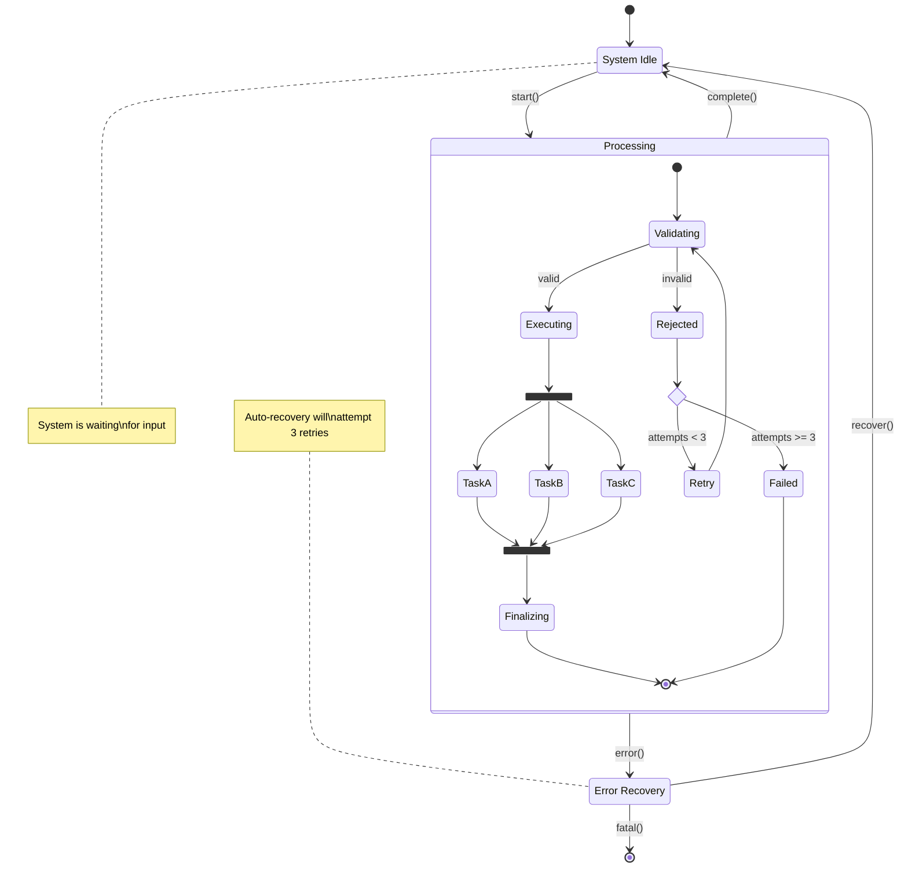
```mermaid
stateDiagram-v2
    [*] --> Idle

    state "System Idle" as Idle
    state "Processing" as Proc
    state "Error Recovery" as Err

    Idle --> Proc : start()
    Proc --> Idle : complete()
    Proc --> Err : error()
    Err --> Idle : recover()
    Err --> [*] : fatal()

    state Proc {
        [*] --> Validating
        Validating --> Executing : valid
        Validating --> Rejected : invalid

        state fork_state <<fork>>
        Executing --> fork_state
        fork_state --> TaskA
        fork_state --> TaskB
        fork_state --> TaskC

        state join_state <<join>>
        TaskA --> join_state
        TaskB --> join_state
        TaskC --> join_state

        join_state --> Finalizing
        Finalizing --> [*]

        state choice_state <<choice>>
        Rejected --> choice_state
        choice_state --> Retry : attempts < 3
        choice_state --> Failed : attempts >= 3
        Retry --> Validating
        Failed --> [*]
    }

    note right of Idle : System is waiting\nfor input
    note left of Err : Auto-recovery will\nattempt 3 retries
```

### State diagram keywords

| Keyword | Usage |
|---------|-------|
| `[*]` | Start / End state |
| `state "name" as id` | Named state |
| `state id { }` | Composite / nested state |
| `<<fork>>` | Fork pseudo-state |
| `<<join>>` | Join pseudo-state |
| `<<choice>>` | Choice pseudo-state |
| `note left/right of` | State note |
| `--` | Divider in composite state |
| `direction LR/TB` | Direction override |

---

## 11. Entity Relationship Diagram

### All cardinality types

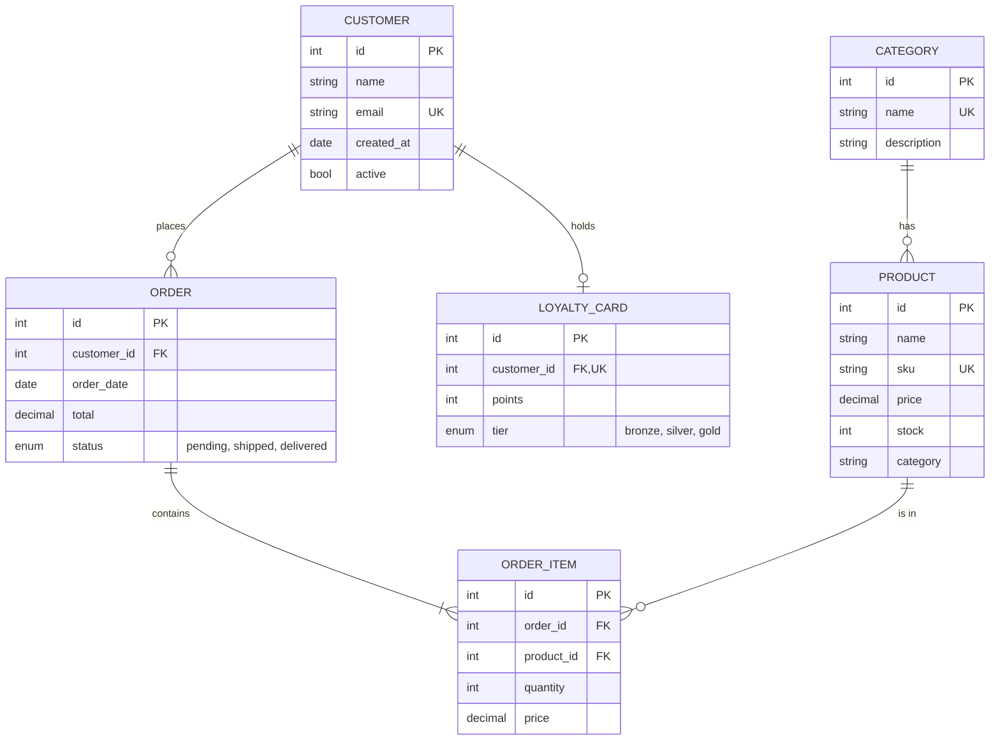
```mermaid
erDiagram
    CUSTOMER ||--o{ ORDER : places
    ORDER ||--|{ ORDER_ITEM : contains
    PRODUCT ||--o{ ORDER_ITEM : "is in"
    CUSTOMER {
        int id PK
        string name
        string email UK
        date created_at
        bool active
    }
    ORDER {
        int id PK
        int customer_id FK
        date order_date
        decimal total
        enum status "pending, shipped, delivered"
    }
    ORDER_ITEM {
        int id PK
        int order_id FK
        int product_id FK
        int quantity
        decimal price
    }
    PRODUCT {
        int id PK
        string name
        string sku UK
        decimal price
        int stock
        string category
    }
    CATEGORY ||--o{ PRODUCT : has
    CATEGORY {
        int id PK
        string name UK
        string description
    }
    CUSTOMER ||--o| LOYALTY_CARD : holds
    LOYALTY_CARD {
        int id PK
        int customer_id FK, UK
        int points
        enum tier "bronze, silver, gold"
    }
```

### Cardinality symbols

| Left | Right | Meaning |
|------|-------|---------|
| `\|\|` | `\|\|` | Exactly one |
| `\|\|` | `o\|` | Zero or one |
| `\|\|` | `o{` | Zero or more |
| `\|\|` | `\|{` | One or more |

### Attribute markers

| Marker | Meaning |
|--------|---------|
| `PK` | Primary Key |
| `FK` | Foreign Key |
| `UK` | Unique Key |

---

## 12. Gantt Chart — Advanced

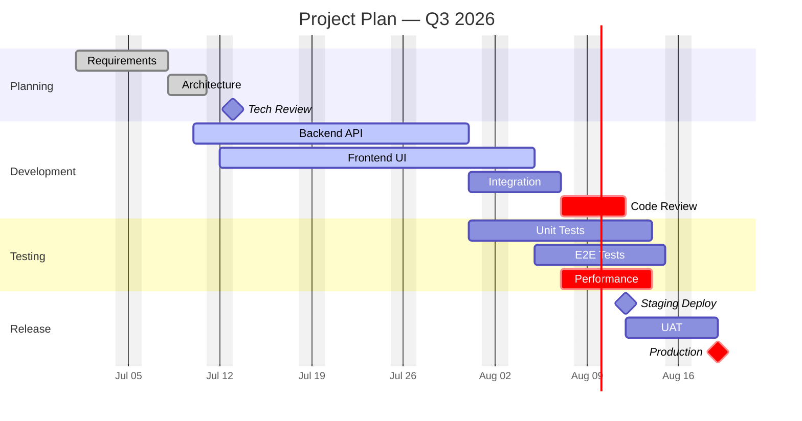
```mermaid
gantt
    title Project Plan — Q3 2026
    dateFormat YYYY-MM-DD
    axisFormat %b %d
    tickInterval 1week
    excludes weekends

    section Planning
        Requirements    :done,    req, 2026-07-01, 5d
        Architecture    :done,    arch, after req, 3d
        Tech Review     :milestone, m1, after arch, 0d

    section Development
        Backend API     :active,  api, 2026-07-10, 15d
        Frontend UI     :active,  ui, 2026-07-12, 18d
        Integration     :         integ, after api, 5d
        Code Review     :crit,    review, after integ, 3d

    section Testing
        Unit Tests      :         ut, after api, 10d
        E2E Tests       :         e2e, after ui, 8d
        Performance     :crit,    perf, after integ, 5d

    section Release
        Staging Deploy  :milestone, m2, after review, 0d
        UAT             :         uat, after m2, 5d
        Production      :crit,milestone, m3, after uat, 0d
```

### Task markers

| Marker | Effect |
|--------|--------|
| `done` | Grayed out (completed) |
| `active` | Highlighted (in progress) |
| `crit` | Red/critical path |
| `milestone` | Diamond marker (0 duration) |

### Date keywords

| Keyword | Usage |
|---------|-------|
| `dateFormat` | Input format: `YYYY-MM-DD`, `DD-MM-YYYY`, etc. |
| `axisFormat` | Display: `%Y-%m-%d`, `%b %d`, `%m/%d` |
| `tickInterval` | `1day`, `1week`, `1month` |
| `excludes` | `weekends`, `2026-12-25` |
| `after taskId` | Dependency |

---

## 13. Pie Chart

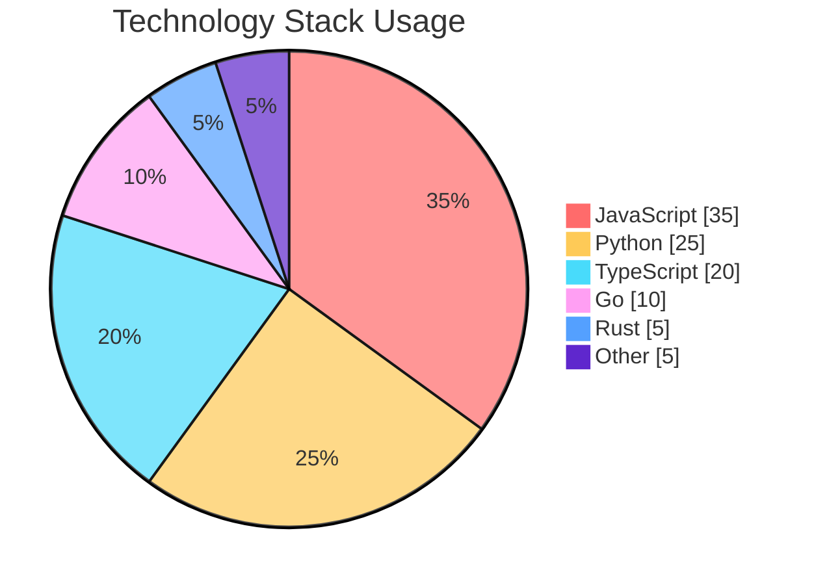
```mermaid
%%{init: {'theme': 'base', 'themeVariables': {'pie1': '#ff6b6b', 'pie2': '#feca57', 'pie3': '#48dbfb', 'pie4': '#ff9ff3', 'pie5': '#54a0ff', 'pie6': '#5f27cd', 'pie7': '#01a3a4'}}}%%
pie showData
    title Technology Stack Usage
    "JavaScript" : 35
    "Python" : 25
    "TypeScript" : 20
    "Go" : 10
    "Rust" : 5
    "Other" : 5
```

- `pie showData` — shows raw values next to labels
- `title` — chart title
- Theme variables `pie1` through `pie12` control segment colors

---

## 14. Quadrant Chart

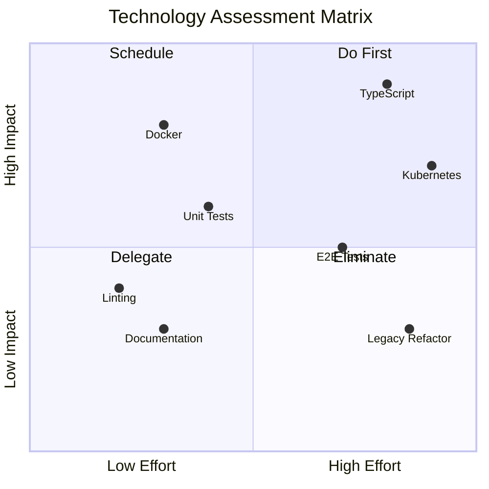
```mermaid
quadrantChart
    title Technology Assessment Matrix
    x-axis Low Effort --> High Effort
    y-axis Low Impact --> High Impact
    quadrant-1 Do First
    quadrant-2 Schedule
    quadrant-3 Delegate
    quadrant-4 Eliminate
    TypeScript: [0.8, 0.9]
    Kubernetes: [0.9, 0.7]
    Docker: [0.3, 0.8]
    Unit Tests: [0.4, 0.6]
    E2E Tests: [0.7, 0.5]
    Linting: [0.2, 0.4]
    Legacy Refactor: [0.85, 0.3]
    Documentation: [0.3, 0.3]
```

---

## 15. Requirement Diagram

```mermaid
requirementDiagram
    requirement UserAuth {
        id: REQ-001
        text: System shall authenticate users via OAuth2
        risk: medium
        verifymethod: test
    }
    requirement DataEncryption {
        id: REQ-002
        text: All data in transit must be encrypted with TLS 1.3
        risk: high
        verifymethod: inspection
    }
    functionalRequirement SessionMgmt {
        id: REQ-003
        text: Sessions expire after 30 minutes of inactivity
        risk: low
        verifymethod: test
    }
    performanceRequirement ResponseTime {
        id: REQ-004
        text: API responses under 200ms at p99
        risk: medium
        verifymethod: analysis
    }
    designConstraint BrowserSupport {
        id: CON-001
        text: Must support Chrome, Firefox, Safari, Edge
        risk: low
        verifymethod: demonstration
    }

    element AuthService {
        type: module
        docRef: auth-service-v2
    }

    AuthService - satisfies -> UserAuth
    AuthService - satisfies -> SessionMgmt
    DataEncryption - refines -> UserAuth
    ResponseTime - traces -> SessionMgmt
```

### Requirement types

| Type | Keyword |
|------|---------|
| Generic | `requirement` |
| Functional | `functionalRequirement` |
| Performance | `performanceRequirement` |
| Interface | `interfaceRequirement` |
| Physical | `physicalRequirement` |
| Design constraint | `designConstraint` |

### Verify methods

`test`, `inspection`, `analysis`, `demonstration`

### Risk levels

`low`, `medium`, `high`

### Relationship types

`satisfies`, `traces`, `contains`, `copies`, `derives`, `refines`, `verifies`

---

## 16. Gitgraph

```mermaid
gitGraph
    commit id: "init"
    commit id: "feat: base setup"
    branch develop
    checkout develop
    commit id: "dev: scaffolding"
    branch feature/auth
    checkout feature/auth
    commit id: "feat: login page"
    commit id: "feat: OAuth2"
    commit id: "test: auth tests"
    checkout develop
    merge feature/auth id: "merge: auth" tag: "v0.2.0"
    branch feature/api
    checkout feature/api
    commit id: "feat: REST endpoints"
    commit id: "feat: GraphQL"
    checkout develop
    merge feature/api id: "merge: api"
    checkout main
    merge develop id: "release" tag: "v1.0.0" type: HIGHLIGHT
    commit id: "hotfix: security" type: REVERSE
    branch hotfix/critical
    checkout hotfix/critical
    commit id: "fix: XSS patch"
    checkout main
    merge hotfix/critical id: "merge: hotfix" tag: "v1.0.1"
```

### Commit types

| Type | Style |
|------|-------|
| `NORMAL` | Default circle |
| `HIGHLIGHT` | Highlighted circle |
| `REVERSE` | Reversed (inverse) circle |

### Keywords

`commit`, `branch`, `checkout`, `merge`, `cherry-pick`, `tag`

---

## 17. C4 Diagram

```mermaid
C4Context
    title System Context — E-Commerce Platform

    Person(customer, "Customer", "Online shopper")
    Person(admin, "Admin", "Store manager")

    System(ecommerce, "E-Commerce Platform", "Handles orders, products, payments")

    System_Ext(payment, "Payment Gateway", "Stripe / PayPal")
    System_Ext(shipping, "Shipping Provider", "FedEx / UPS API")
    System_Ext(email, "Email Service", "SendGrid")

    Rel(customer, ecommerce, "Browses & purchases", "HTTPS")
    Rel(admin, ecommerce, "Manages products & orders", "HTTPS")
    Rel(ecommerce, payment, "Processes payments", "API")
    Rel(ecommerce, shipping, "Creates shipments", "API")
    Rel(ecommerce, email, "Sends notifications", "SMTP")

    UpdateLayoutConfig($c4ShapeInRow="3", $c4BoundaryInRow="1")
```

### C4 diagram types

| Keyword | Level |
|---------|-------|
| `C4Context` | System context |
| `C4Container` | Container level |
| `C4Component` | Component level |
| `C4Dynamic` | Dynamic (numbered flows) |
| `C4Deployment` | Deployment view |

### C4 element keywords

| Keyword | Usage |
|---------|-------|
| `Person(id, label, desc)` | External person |
| `Person_Ext(...)` | External person |
| `System(id, label, desc)` | System |
| `System_Ext(...)` | External system |
| `SystemDb(...)` | Database system |
| `SystemQueue(...)` | Queue system |
| `Container(...)` | Container |
| `ContainerDb(...)` | Database container |
| `ContainerQueue(...)` | Queue container |
| `Component(...)` | Component |
| `Boundary(id, label) { }` | Group boundary |
| `Rel(from, to, label, tech)` | Relationship |
| `BiRel(...)` | Bidirectional |
| `Rel_U/D/L/R(...)` | Directional |

---

## 18. Mindmap

```mermaid
mindmap
    root((Software Engineering))
        Frontend
            React
                Hooks
                Context API
                Server Components
            Vue
                Composition API
                Pinia
            Svelte
                Runes
                SvelteKit
        Backend
            Node.js
                Express
                Fastify
                NestJS
            Python
                FastAPI
                Django
            Go
                Gin
                Echo
        DevOps
            CI/CD
                GitHub Actions
                GitLab CI
            Containers
                Docker
                Kubernetes
            IaC
                Terraform
                Pulumi
        Data
            SQL
                PostgreSQL
                MySQL
            NoSQL
                MongoDB
                Redis
            Streaming
                Kafka
                RabbitMQ
```

### Node shapes in mindmap

| Syntax | Shape |
|--------|-------|
| `id` | Default rectangle |
| `id[text]` | Square |
| `id(text)` | Rounded |
| `id((text))` | Circle |
| `id))text((` | Bang (explosion) |
| `id)text(` | Cloud |
| `id{{text}}` | Hexagon |

---

## 19. Timeline

```mermaid
timeline
    title History of Web Development
    section 1990s
        1991 : First website by Tim Berners-Lee
        1993 : Mosaic browser
        1995 : JavaScript created in 10 days
             : PHP released
             : Java applets
        1996 : CSS 1.0 specification
        1998 : Google founded
    section 2000s
        2004 : Gmail launches (AJAX era)
             : Facebook founded
        2005 : YouTube launches
        2006 : jQuery released
             : AWS launches EC2
        2008 : Chrome browser
             : GitHub founded
    section 2010s
        2010 : Node.js released
             : AngularJS
        2013 : React by Facebook
             : Docker released
        2014 : Vue.js released
             : Kubernetes released
        2015 : ES6 / ES2015
             : GraphQL
    section 2020s
        2020 : Deno 1.0
             : Tailwind CSS 2.0
        2022 : Bun runtime
             : ChatGPT
        2023 : React Server Components
        2024 : Vite 5 / WebGPU
```

---

## 20. Sankey Diagram

```mermaid
sankey-beta
    Source Energy,Electricity,40
    Source Energy,Heat,35
    Source Energy,Transport,25
    Electricity,Residential,15
    Electricity,Commercial,15
    Electricity,Industrial,10
    Heat,Residential,20
    Heat,Industrial,15
    Transport,Road,18
    Transport,Rail,4
    Transport,Air,3
    Residential,Useful,25
    Residential,Waste,10
    Commercial,Useful,12
    Commercial,Waste,3
    Industrial,Useful,20
    Industrial,Waste,5
```

> Format: `Source,Target,Value` — one flow per line. No quotes needed unless labels contain commas.

---

## 21. XY Chart (Bar + Line)

```mermaid
xychart-beta
    title "Monthly Revenue & Growth Rate"
    x-axis ["Jan", "Feb", "Mar", "Apr", "May", "Jun", "Jul", "Aug", "Sep", "Oct", "Nov", "Dec"]
    y-axis "Revenue ($K)" 0 --> 500
    bar [120, 150, 180, 200, 250, 280, 310, 350, 320, 380, 420, 480]
    line [120, 150, 180, 200, 250, 280, 310, 350, 320, 380, 420, 480]
```

---

## 22. Block Diagram

```mermaid
block-beta
    columns 3

    a["Frontend"]:3
    
    block:backend:2
        columns 2
        c["API Gateway"]
        d["Auth Service"]
        e["Order Service"]
        f["Product Service"]
    end

    block:data:1
        columns 1
        g[("PostgreSQL")]
        h[("Redis")]
    end

    a --> backend
    backend --> data
```

---

## 23. Kanban Board

```mermaid
kanban
  Backlog
    task1[Design system]
    task2[API specification]
    task3[Database schema]
  Todo
    task4[Setup CI/CD]
    task5[Auth module]
  In Progress
    task6[REST endpoints]
    task7[Frontend routing]
  Review
    task8[Unit tests]
  Done
    task9[Project scaffolding]
    task10[Dev environment]
```

---

## 24. Architecture Diagram

```mermaid
architecture-beta
    group cloud(cloud)[Cloud Platform]

    service web(server)[Web Server] in cloud
    service api(server)[API Server] in cloud
    service db(database)[Database] in cloud
    service cache(database)[Cache] in cloud
    service queue(server)[Queue] in cloud

    web:R --> L:api
    api:R --> L:db
    api:B --> T:cache
    api:R --> L:queue
```

---

## 25. Packet Diagram

```mermaid
packet-beta
    0-15: "Source Port"
    16-31: "Destination Port"
    32-63: "Sequence Number"
    64-95: "Acknowledgment Number"
    96-99: "Data Offset"
    100-105: "Reserved"
    106: "URG"
    107: "ACK"
    108: "PSH"
    109: "RST"
    110: "SYN"
    111: "FIN"
    112-127: "Window Size"
    128-143: "Checksum"
    144-159: "Urgent Pointer"
    160-191: "Options (if Data Offset > 5)"
```

---

## 26. Zenuml Sequence

```mermaid
zenuml
    title Order Processing
    
    @Actor Customer
    @Boundary WebApp
    @Controller OrderAPI
    @Entity OrderDB

    Customer->WebApp.placeOrder() {
        WebApp->OrderAPI.createOrder(items) {
            OrderAPI->OrderDB.save(order) {
                return orderId
            }
            if (paymentRequired) {
                OrderAPI->PaymentService.charge(amount) {
                    return receipt
                }
            }
            return orderConfirmation
        }
        return displayConfirmation
    }
```

---

## 27. Theming & %%init%%

### Available themes

```mermaid
%%{init: {'theme': 'forest'}}%%
graph LR
    A[Default] --> B[Dark]
    B --> C[Forest]
    C --> D[Neutral]
    D --> E[Base]
    style A fill:#f5f5f5,color:#333
    style B fill:#333,color:#fff
    style C fill:#cde498,color:#333
    style D fill:#e8e8e8,color:#333
    style E fill:#fff,color:#333
```

### Theme variable reference (for `base` theme)

The `base` theme exposes **all** CSS variables for full customization:

| Variable | Controls |
|----------|----------|
| `primaryColor` | Main node fill |
| `primaryTextColor` | Text on primary |
| `primaryBorderColor` | Border on primary |
| `secondaryColor` | Secondary fills |
| `tertiaryColor` | Tertiary fills |
| `lineColor` | Lines / arrows |
| `textColor` | General text |
| `mainBkg` | Background of main area |
| `nodeBorder` | Node border color |
| `clusterBkg` | Subgraph background |
| `clusterBorder` | Subgraph border |
| `titleColor` | Diagram title |
| `edgeLabelBackground` | Edge label bg |
| `nodeTextColor` | Node text |
| `actorBkg` | Sequence actor bg |
| `actorBorder` | Sequence actor border |
| `actorTextColor` | Sequence actor text |
| `activationBorderColor` | Activation bar border |
| `signalColor` | Sequence arrow color |
| `labelBoxBkgColor` | Label bg |
| `noteBkgColor` | Note background |
| `noteBorderColor` | Note border |
| `noteTextColor` | Note text |
| `sectionBkgColor` | Gantt section bg |
| `altSectionBkgColor` | Gantt alt section |
| `gridColor` | Grid lines |
| `taskBkgColor` | Gantt task bg |
| `taskTextColor` | Gantt task text |
| `activeTaskBkgColor` | Active task bg |
| `doneTaskBkgColor` | Completed task bg |
| `critBkgColor` | Critical task bg |
| `pie1` through `pie12` | Pie segment colors |
| `git0` through `git7` | Gitgraph branch colors |

### Per-diagram configuration via init

```mermaid
%%{init: { 'flowchart': { 'curve': 'basis', 'padding': 20 }, 'theme': 'neutral' } }%%
graph LR
    A[Smooth] --> B[Curves]
    B --> C[With Basis]
    C --> D[Interpolation]
    A --> D
```

### Flowchart curve types

| Value | Effect |
|-------|--------|
| `basis` | Smooth curves |
| `linear` | Straight lines |
| `stepBefore` | Step function (before) |
| `stepAfter` | Step function (after) |
| `natural` | Natural spline |
| `monotoneX` | Monotone in X |
| `monotoneY` | Monotone in Y |
| `cardinal` | Cardinal spline |
| `catmullRom` | Catmull-Rom spline |

---

## 28. Naming Conventions & Best Practices

### Node IDs

```
✅ Good                    ❌ Bad
─────────────────          ─────────────────
userId                     user id (spaces)
order_item                 123start (starts with digit)
apiGateway                 end (reserved keyword)
DB_primary                 graph (reserved keyword)
svc_auth                   class (may conflict)
```

### General guidelines

1. **Use short, descriptive IDs** — `authSvc` not `theAuthenticationServiceModule`
2. **Display labels for humans** — `authSvc["Authentication Service"]`
3. **One diagram per concept** — don't overload a single chart
4. **Use `direction`** — `LR` for processes/flows, `TD` for hierarchies
5. **Group with subgraphs** — logical boundaries improve readability
6. **Use `classDef`** — define reusable styles rather than inline `style` everywhere
7. **Limit nodes** — 15-25 nodes per diagram for readability
8. **Use `%%` comments** — `%% This is a comment`

### Comments

```mermaid
graph LR
    %% This is a comment — not rendered
    A[Start] --> B[End]
    %% Comments can go anywhere between statements
```

---

## 29. Hidden Features & Undocumented Tricks

### 1. Markdown strings in nodes (v10.7+)

```mermaid
graph TD
    A["`**Bold** and *italic*
    in a node`"]
    B["`Items:
    - One
    - Two
    - Three`"]
    A --> B
```

> Use backtick-quoted strings `` "`...`" `` for markdown formatting inside nodes.

### 2. Multiple edges in one statement

```mermaid
graph LR
    A --> B & C & D
    B & C --> E
```

> The `&` operator fans out edges — one statement creates multiple connections.

### 3. Double-quoted labels with special chars

```mermaid
graph LR
    A["Node with (parens) and {braces}"]
    B["Arrows: --> and ==>"]
    C["Pipes: |value|"]
    A --> B --> C
```

> Wrapping in `"..."` lets you use any character that would normally be parsed as syntax.

### 4. Entity codes in labels

```mermaid
graph LR
    A["#9829; Hearts"]
    B["#9733; Stars"]
    C["#8594; Arrows"]
    A --> B --> C
```

> Use `#entity_number;` for HTML entity codes without the `&` prefix.

### 5. Gantt sections as swimlanes

```mermaid
gantt
    dateFormat X
    axisFormat %s
    section Thread 1
        Task A :0, 3
        Task B :3, 5
    section Thread 2
        Task C :1, 4
        Task D :4, 6
    section Thread 3
        Task E :0, 6
```

> Using `dateFormat X` (Unix epoch) turns Gantt into a generic timeline/swimlane diagram.

### 6. `linkStyle default` for all edges

```mermaid
graph LR
    A --> B --> C --> D
    linkStyle default stroke:#e74c3c,stroke-width:2px,color:red
```

### 7. Invisible nodes for spacing

```mermaid
graph LR
    A --> B
    B --> C
    A --> invisible:::hidden --> C
    classDef hidden display:none
```

### 8. `%%` initialization stacking

You can combine init directives with diagram content seamlessly:

```mermaid
%%{init: {'theme':'dark'}}%%
graph LR
    A[Dark theme] --> B[Applied via init]
```

### 9. Sequence diagram actor aliases with emoji

```mermaid
sequenceDiagram
    actor U as 👤 User
    participant S as 🖥️ Server
    participant D as 💾 Database

    U->>S: Request
    S->>D: Query
    D-->>S: Results
    S-->>U: Response
```

### 10. Rich tooltip in flowchart

```mermaid
graph LR
    A[Hover me]
    click A callback "This tooltip appears on hover!"
```

### 11. Nested subgraph references

```mermaid
graph TB
    subgraph outer ["System"]
        subgraph inner1 ["Module A"]
            a1[Component 1]
            a2[Component 2]
        end
        subgraph inner2 ["Module B"]
            b1[Component 3]
            b2[Component 4]
        end
    end
    inner1 --> inner2
```

> You can draw edges between **subgraph IDs** themselves, not just individual nodes.

### 12. Semicolons as statement separators

```mermaid
graph LR
    A --> B; B --> C; C --> D; D --> A
```

> You can write an entire flowchart on a single line using `;`.

---

## Diagram Type Quick Reference

| Type | Keyword | Status |
|------|---------|--------|
| Flowchart | `graph` / `flowchart` | Stable |
| Sequence | `sequenceDiagram` | Stable |
| Class | `classDiagram` | Stable |
| State | `stateDiagram-v2` | Stable |
| ER Diagram | `erDiagram` | Stable |
| Gantt | `gantt` | Stable |
| Pie | `pie` | Stable |
| Gitgraph | `gitGraph` | Stable |
| C4 | `C4Context` / etc. | Stable |
| Mindmap | `mindmap` | Stable |
| Timeline | `timeline` | Stable |
| Quadrant | `quadrantChart` | Stable |
| Requirement | `requirementDiagram` | Stable |
| Sankey | `sankey-beta` | Beta |
| XY Chart | `xychart-beta` | Beta |
| Block | `block-beta` | Beta |
| Packet | `packet-beta` | Beta |
| Architecture | `architecture-beta` | Beta |
| Kanban | `kanban` | Beta |
| ZenUML | `zenuml` | Stable |

---

*Generated for [docsify-mermaid-lightbox](/) — click any diagram to open in the lightbox.*
